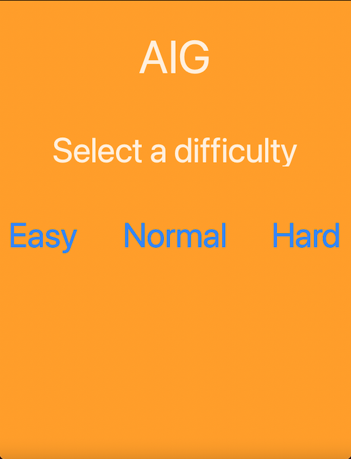
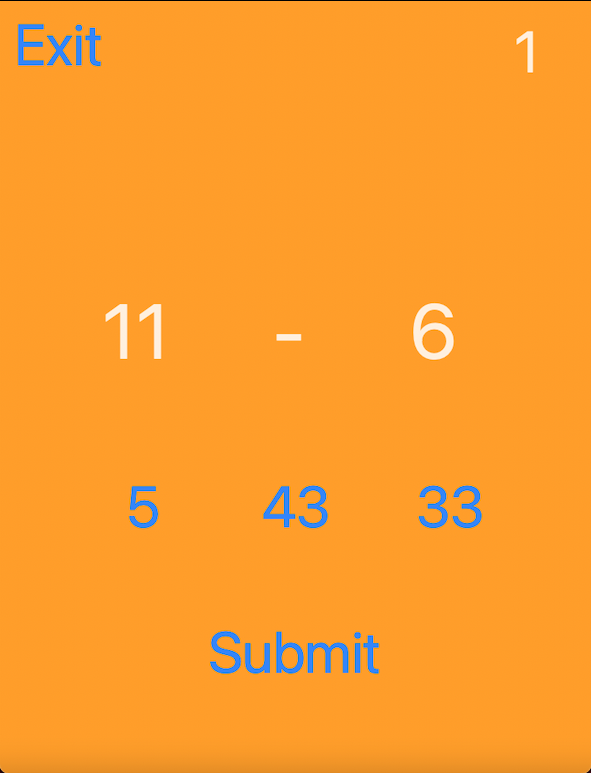
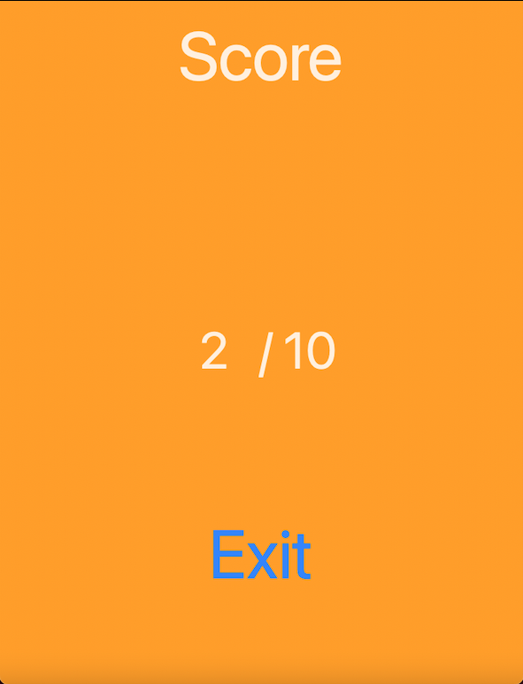

# Arithmetic Improvement Game

An arithmetic improvement game.

## Table of Contents

<!--toc:start-->
  - [General Information](#general-information)
  - [Screenshots](#screenshots)
  - [License](#license)
<!--toc:end-->

## General Information

I built this project for a College assignment using the College's Macs, and I've been unable to edit the project since due to not owning a Mac.

## Screenshots

## License

All code is MIT licensed. The MP3 files are under an unknown license as I'm not sure where I obtained them (years ago).
